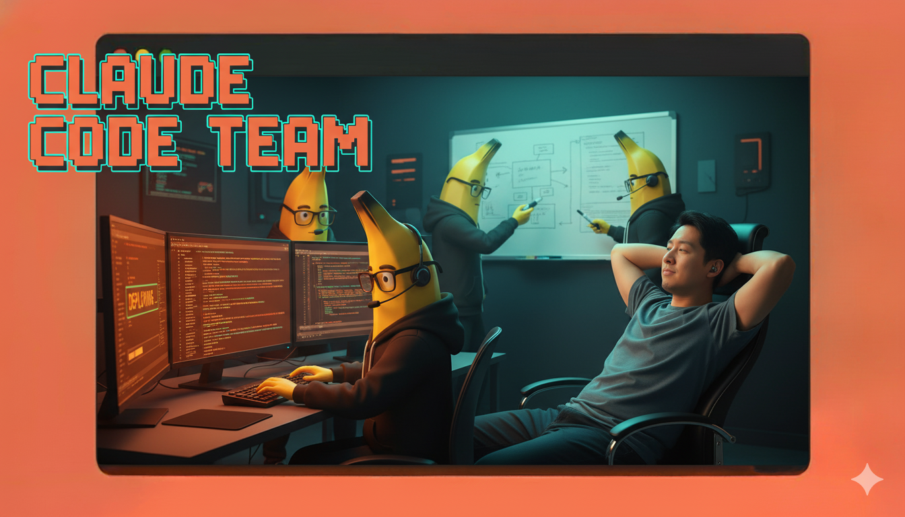

# Claude Agent SDK: ステップバイステップチュートリアル

## ビデオを見る！

[](https://youtu.be/gP5iZ6DCrUI)

Claude Codeは、おそらくあなたが知る中で最も印象的で最も有能なAIエージェントです。これをあらゆることに活用できたら...今ではそれが可能になりました！Claude Agent SDKは、Claude Codeをコアエージェントとして使用し、カスタムAIエージェントシステムを構築するための高レベルフレームワークです。

## 学べること

- ファイルを自律的に読み取り、書き込み、編集できるAIエージェントの作成
- 複数のやり取りを通じてコンテキストを記憶する会話型エージェントの構築
- Model Context Protocol (MCP)を通じた強力な外部ツールの統合
- 複雑なマルチステップワークフローを処理する専門的なサブエージェントの設計
- カスタムシステムプロンプトとツール権限によるエージェント動作の設定

## 前提条件

始める前に、以下を準備してください：

- **Python 3.13+** がシステムにインストールされていること
- **uv** がインストールされていること [インストール手順](https://docs.astral.sh/uv/getting-started/installation/)
- **Claude Code** がインストールされていること
`npm install -g @anthropic-ai/claude-code`
- **Chrome ブラウザ** (モジュール5-6のPlaywright MCP統合に必要)
- **Node.js** (モジュール5-6のPlaywright MCP統合に必要)

オプション (以下のステップ3を参照):
Anthropic APIキーを使用するか、Claude Codeで認証することができます。Claude Codeで認証する場合、APIキーを設定する必要はありません。
- **Anthropic APIキー** ([console.anthropic.com](https://console.anthropic.com)で取得)

## クイックスタート

### 1. リポジトリのクローン

```bash
git clone https://github.com/kenneth-liao/claude-agent-sdk-intro
cd claude-agent-sdk-intro
```

### 2. 環境のセットアップ

仮想環境を作成し、依存関係をインストールします：

```bash
uv sync
```

### 3. APIキーの設定 (オプション)

Anthropic APIキーを使用する場合（上記の前提条件を参照）、

プロジェクトルートに `.env` ファイルを作成します：

```bash
ANTHROPIC_API_KEY=your_api_key_here
```

### 4. ローカル設定の構成

**重要:** `.claude/settings.json` ファイルには、ローカル環境に合わせて更新する必要があるシステム固有のファイルパスが含まれています。

`.claude/settings.json` を編集し、サウンドファイルのパスをシステムに合わせて更新してください。また、uv runコマンドのパスをPythonファイルへの絶対パスに更新する必要がある場合もあります。

```json
{
  "outputStyle": "Personal Assistant",
  "hooks": {
    "Stop": [
      {
        "hooks": [
          {
            "type": "command",
            "command": "afplay /System/Library/Sounds/Funk.aiff"
          },
          {
            "type": "command",
            "command": "uv run .claude/hooks/log_agent_actions.py"
          }
        ]
      }
    ],
    "Notification": [
      {
        "hooks": [
          {
            "type": "command",
            "command": "afplay /System/Library/Sounds/Purr.aiff"
          }
        ]
      }
    ]
  }
}
```

**macOSユーザーの場合:** デフォルトのパスがそのまま動作するはずです。

**Linux/Windowsユーザーの場合:** `afplay` コマンドを適切な代替コマンドに置き換えてください：
- **Linux:** `aplay`、`paplay`、または `play` (soxから)を使用
- **Windows:** `powershell -c (New-Object Media.SoundPlayer "C:\Windows\Media\notify.wav").PlaySync()` を使用

または、オーディオ通知が不要な場合は、サウンドコマンドを削除してください。

### 5. 最初のモジュールを実行

```bash
python 0_querying.py
```

## モジュール概要

### モジュール 0: クエリの基礎
**ファイル:** `0_querying.py`

Claudeと対話する2つの基本的な方法を学びます：単発タスク用の `query()` と継続的な会話用の `ClaudeSDKClient`。それぞれのアプローチをいつ使用するか、基本的なエージェントオプションの設定方法を理解します。

### モジュール 1: メッセージ処理
**ファイル:** `1_messages.py`

SDKからのさまざまなメッセージタイプの解析と表示をマスターします。Richを使用してクリーンなCLIインターフェースを作成し、フォーマットされた出力とステータスインジケーターでユーザーエクスペリエンスを向上させる方法を学びます。

### モジュール 2: カスタムツール
**ファイル:** `2_tools.py`

製品検索機能を作成して、最初のカスタムツールを構築します。3つのステッププロセスを学びます：ツールの定義、MCPサーバーの作成、エージェントの設定。ツールの命名規則と統合パターンを理解します。

### モジュール 3: エージェントオプション
**ファイル:** `3_options.py`

`ClaudeAgentOptions` でエージェントの動作を設定します。ツールの権限制御、カスタムシステムプロンプトの設定、モデルの選択、ファイルアクセスの管理を行います。さまざまなオプションの組み合わせを試して、それらがどのように相互作用するかを確認します。

### モジュール 4: 会話ループ
**ファイル:** `4_convo_loop.py`

ユーザーがエージェントと双方向にチャットできる継続的な会話インターフェースを構築します。複数のターンにわたってコンテキストを維持し、自然な会話体験を作成する方法を学びます。

### モジュール 5: Model Context Protocol (MCP)
**ファイル:** `5_mcp.py` | **ドキュメント:** [module-5-mcp.md](docs/module-5-mcp.md)

MCPサーバーを通じて外部ツールを統合します。ブラウザ自動化のためにPlaywrightを接続し、エージェントがウェブサイトをナビゲートし、スクリーンショットを撮り、ウェブページと対話できるようにします。MCPエコシステムを発見し、組み込みツール以上の強力な機能を追加する方法を学びます。

**前提条件:** Node.jsとChromeブラウザ

### モジュール 6: サブエージェント
**ファイル:** `6_subagents.py` | **ドキュメント:** [module-6-subagents.md](docs/module-6-subagents.md)

特定のタスクを独立して処理する専門的なAIエージェントを作成します。分離されたコンテキストと制限されたツールアクセスを持つエキスパートサブエージェントに作業を委任する方法を学びます。トピックをリサーチし、データを分析し、複雑なワークフローを並列に調整できるマルチエージェントシステムを構築します。

**前提条件:** モジュール5（MCPツールを使用）

## モジュールの実行

各モジュールは個別に実行できます：

```bash
# デフォルトのHaikuモデルで実行（高速、経済的）
python <module_file>.py

# Sonnetモデルで実行（バランスの取れたパフォーマンス）
python <module_file>.py --model claude-sonnet-4-20250514

# Opusモデルで実行（最大能力）
python <module_file>.py --model claude-opus-4-20250514
```

注意: モジュール0-2はモデルがハードコードされています。モジュール3-6は `--model` フラグを受け付けます。

## プロジェクト構造

```
claude-agent-sdk-intro/
├── 0_querying.py           # 基本的なクエリパターン
├── 1_messages.py           # メッセージの解析と表示
├── 2_tools.py              # カスタムツールの作成
├── 3_options.py            # エージェント設定
├── 4_convo_loop.py         # 会話ループ
├── 5_mcp.py                # MCP統合
├── 6_subagents.py          # マルチエージェントシステム
├── cli_tools.py            # CLIヘルパー関数
├── main.py                 # (オプション) メインエントリーポイント
├── db/                     # ツール用サンプルデータ
├── docs/                   # 詳細なモジュールドキュメント
└── .claude/                # Claudeエージェント設定
```

## 追加リソース

- [Agent SDK Documentation (Python)](https://docs.claude.com/en/api/agent-sdk/python)
- [MCP Servers Directory](https://github.com/modelcontextprotocol/servers)
- [Anthropic API Documentation](https://docs.anthropic.com)

## 学習のヒント

1. **順番に従う** - 各モジュールは前のモジュールの概念に基づいて構築されています
2. **実験する** - コードを変更し、さまざまなプロンプトを試して、何が起こるかを確認してください
3. **ドキュメントを読む** - モジュール5と6には、例を含む詳細なドキュメントがあります
4. **シンプルに始める** - テストにはHaikuを使用し、本番環境にはSonnetにアップグレードしてください
5. **ソースを確認する** - `cli_tools.py` のヘルパー関数は有用なパターンを示しています

## よくある問題

**インポートエラー:** `uv sync` を実行し、仮想環境をアクティブ化したことを確認してください

**APIエラー:** `.env` で `ANTHROPIC_API_KEY` が正しく設定されていることを確認してください

**モジュール5-6が動作しない:** PlaywrightのためにNode.jsとChromeがインストールされていることを確認してください

**サウンド/通知エラー:** `.claude/settings.json` のファイルパスをシステムのサウンドファイルに合わせて更新するか、不要な場合はサウンドコマンドを削除してください

## 次のステップ

すべてのモジュールを完了した後：

- 特定のタスク用の独自の専門エージェントを構築する
- 追加ツールのためにMCPエコシステムを探索する
- 概念を組み合わせて洗練されたマルチエージェントワークフローを作成する
- コミュニティであなたの作品を共有する

楽しく構築してください！ 🚀
